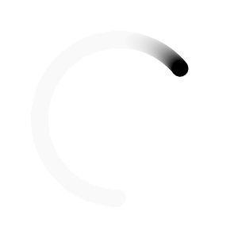

## Ser du etter slides?

De ligger i mappa [slides](slides/).

## Jeg skal jobbe rett i nettleseren

Du kan du gå til [p5.js sin online editor](https://editor.p5js.org/).

Det anbefales sterkt å opprette en bruker og logge inn, for å kunne lagre arbeidet ditt.

Under er noen utgangspunkt du kan ta med deg og lime rett inn i editoren:

Du kan også se om du finner noe du liker på [p5.js sin eksempelsamling](https://p5js.org/examples/), eller i slidesene.

<details>
<summary>Flislagte diagonaler</summary>


```javascript
const CANVAS = 500;
const tiles = 20;
const tileSize = CANVAS / tiles;

function setup() {
  createCanvas(CANVAS, CANVAS);
}

function draw() {
  noLoop();
  background("white");
  stroke("black");
  strokeWeight(2);

  for (let row = 0; row < tiles; row++) {
    for (let column = 0; column < tiles; column++) {
      drawTile(row, column);
    }
  }
}

function drawTile(row, column) {
  const top = tileSize * row;
  const bottom = top + tileSize;
  const left = tileSize * column;
  const right = left + tileSize;
  if (random() > 0.5) {
    line(left, top, right, bottom);
  } else {
    line(right, top, left, bottom);
  }
}
```

</details>

<details>
<summary>Snøfnugg</summary>


```javascript
const CANVAS = 800;
const snowflakeSize = 0.8;

function setup() {
  createCanvas(CANVAS, CANVAS);
}

function draw() {
  noLoop();
  background("midnightblue");
  // forskyver koodinatsystemet slik at (0, 0) er midten av lerretet
  translate(CANVAS / 2, CANVAS / 2);
  for (let i = 0; i < 6; i++) {
    stroke("white");
    strokeWeight(3);
    // tegner en linje fra midten og nedover
    line(0, 0, 0, (CANVAS * snowflakeSize) / 2);
    // rotér koordinatsystemet en sjettedel av en sirkel
    // da kan vi fortsette å tegne fra midten og nedover
    rotate(TWO_PI / 6);
  }
}
```

</details>

<details>
<summary>Roterende sirkel</summary>



```javascript
const CANVAS = 500;
let timeInSeconds = 0;

function setup() {
  createCanvas(CANVAS, CANVAS);
  background("white");
}

function draw() {
  timeInSeconds += deltaTime / 1000;
  background(255, 20);

  translate(CANVAS / 2, CANVAS / 2);
  rotate(timeInSeconds);

  fill("black");
  circle(0, 200, 30);
}
```

</details>

<details>
<summary>Kvartsirkler</summary>


```javascript
// Kan du lage en "flislagt" versjon av denne?
// Hent inspirasjon fra "flislagte diagonaler"-eksempelet
const CANVAS = 500;

function setup() {
  createCanvas(CANVAS, CANVAS);
  background("white");
}

function draw() {
  noLoop();
  noFill();

  const left = 0;
  const right = CANVAS;
  const top = 0;
  const bottom = CANVAS;
  if (random() > 0.5) {
    drawQuarterCircle(left, bottom, CANVAS / 2, PI + HALF_PI);
    drawQuarterCircle(right, top, CANVAS / 2, HALF_PI);
  } else {
    drawQuarterCircle(left, top, CANVAS / 2, 0);
    drawQuarterCircle(right, bottom, CANVAS / 2, PI);
  }
}

function drawQuarterCircle(
  circleCenterX,
  circleCenterY,
  circleRadius,
  startAngle
) {
  arc(
    circleCenterX,
    circleCenterY,
    circleRadius * 2,
    circleRadius * 2,
    startAngle,
    startAngle + HALF_PI
  );
}
```

</details>

## Installasjon og oppsett

Installer det du trenger ved å kjøre

```bash
yarn install
# eller
npm install
```

Kjør igang prosjektet ved å kjøre

```bash
yarn dev
# eller
npm run dev
```

Prosjektet skal da kjøre i gang en port på localhost, og du kan se resultatet i nettleseren.
Standard port er [http://localhost:5173](http://localhost:5173).

## Opprette en sketch

Du kan lage en ny sketch ved å opprette en fil i mappa [src/sketches](src/sketches/).

For å kunne velge den i visningen i nettleseren, må du også registrere sketchen din ved å legge den til i [src/registerSketches.ts](src/registerSketches.ts):

```typescript
// andre imports...
import { mySketch } from "./mySketch";

export const sketches: Record<string, SketchClosure> = {
  // ... det som ligger der fra før
  "Min kule sketch": mySketch,
};
```

### Mal for TypeScript

For TypeScript-brukere, kan du kopiere fila [src/sketches/\_template.ts](src/sketches/_template.ts) og oppdatere den med ditt eget navn og innhold, eller bare kopiere malen som ligger under under.

<details>
<summary>Mal for TypeScript-sketcher</summary>

```typescript
import P5 from "p5";

// bruk denne fila som en mal på hvordan sketcher kan utformes!
// kopier fila, husk å endre navnet på både fila og funksjonen.
// oppdater også src/registerSketches.ts slik at den peker på den nye fila.
export function sketchTemplate(p5: P5) {
  // setup-funksjonen kjører én gang når siden lastes inn.
  p5.setup = () => {
    p5.createCanvas(400, 400);
  };

  // draw-funksjonen kjører kontinuerlig etter setup.
  // hvis du ikke vil at draw skal kjøre kontinuerlig,
  // kan du kalle p5.noLoop() i enten setup eller draw.
  p5.draw = () => {
    p5.background(220);
  };
}
```

</details>

### Mal for JavaScript

For JavaScript-brukere er det [src/sketches/\_template.js](src/sketches/_template.js) som gjelder

<details>
<summary>Mal for JavaScript-sketcher</summary>

```javascript
// bruk denne fila som en mal på hvordan sketcher kan utformes!
// kopier fila, husk å endre navnet på både fila og funksjonen.
// oppdater også src/registerSketches.ts slik at den peker på den nye fila.
export function mySketch(p5) {
  // setup-funksjonen kjører én gang når siden lastes inn.

  p5.setup = () => {};

  // draw-funksjonen kjører kontinuerlig etter setup.
  // hvis du ikke vil at draw skal kjøre kontinuerlig,
  // kan du kalle p5.noLoop() i enten setup eller draw.
  p5.draw = () => {};
}
```

</details>

## Hva skal jeg gjøre?

Slipp kreativiteten helt løs, og gjør akkurat hva du vil!

Du kan jo piffe opp de eksiterende sketchene litt:

- [snowflake.ts](src/sketches/snowflake.ts) prøver å lage et snøfnugg, men har ikke kommet seg så langt av gårde
- [quarterCircles.ts](src/sketches/quarterCircles.ts) har laget kvartsirkler i hjørnene, men trenger hjelp med å bli flislagt
- [spinningCircle.ts](src/sketches/spinningCircle.ts) har en snurrende sirkel, men den er litt kjedelig. Kan du gjøre den mer spennende?

Du kan også finne gode eksempler på hva som er mulig på [p5.js sin eksempelsamling](https://p5js.org/examples/).

Eller, hvis du er litt mer nerdete anlagt kan du lese [dokumentasjonen direkte](https://p5js.org/reference/).
